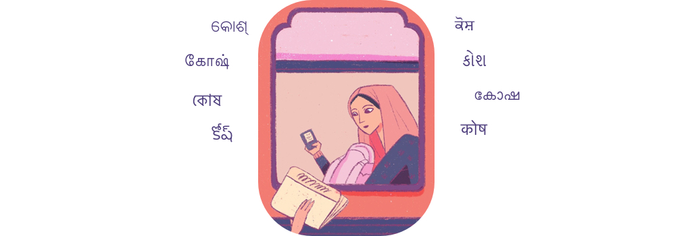

# Kosh is a searchable archive for multimedia content.

Kosh empowers small and big media outfits to archive and annotate media that they find circulating on various social media that could be potential misinformation or trigger violence. The ability to have autonomous operations enables small  teams to focus on their area of interest and expertise. It could be limited to a geographical region or one genre of misinformation like healthcare. Organizations can join forces with other federated Khoj archives that they trust, eventually joining forces to become a trusted media archive that can be used for quick searches to verify the source of a media item. Since trust is built over time and needs to be continually built, Khoj would help make the data in all the archives - the media itself and its metadata, as open as possible, to enable third party independent investigations too.

## Current Status

## Features
- store data manually or automatically via diverse sources like - fact checking websites, telegram, whatsapp, sharechat etc
- add your own data sources via kosh API
- index media in our search service
- search for media in multipe modalities - text, image, video

## Immediate Roadmap 

|    In Progress    | Up next     |  On the Horizon   | Completed    |
| ------------------| ------------| ----------------- | -------------|
| annotation UI  | video search   | audio search  | text search |
|                |                | whatsapp bot  | tag search

## Local Development
[guide](https://github.com/tattle-made/kosh/blob/master/docs/development.md)

## Deploy to development server

## Deploy to production

Outline

Current Status
Architecture

## Request Access

Join the kosh server hosted by us to get a tour of all the features and the current state of the project.

## Run your own Instance
## To get help with developing or running Kosh

Join our [slack channel](https://join.slack.com/t/tattle-workspace/shared_invite/zt-da07n75v-kIw9Z5b~_gDKP~JsScP1Vg) to get someone to respond to immediate doubts and queries.

## Want to get help deploying it into your organisation?

contact us at admin@tattle.co.in

## Want to contribute to Kosh?