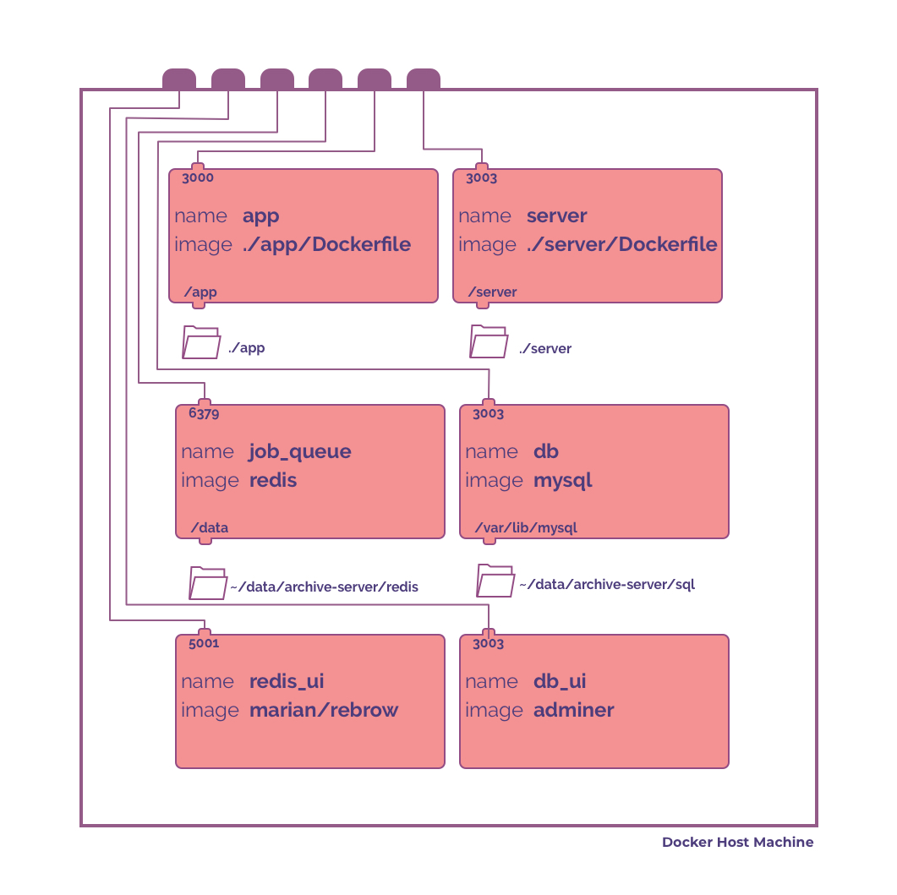

# Development
We use docker for local development. The docker-compose.yml file in the root folder setups the following containers:


A general description of the various containers are as follows :
1. app : a create-react-app development server serving the webapp on localhost:3000
2. server : a typescript express REST API server
3. redis : a redis server that serves as a cache, data store for job queues and real time messaging needs of the app
4. mysql : a SQL server that is the primary data store of the server
5. adminer : a web UI for the SQL database
6. rebrow : a web UI for redis

Note : 5, 6 are optional and mainly meant to assist in debugging. Its alright to comment them out in the docker-compose.yml without affecting the performance of the app.

## Prerequisites
- Docker
- Chrome (for debugging react website)
- VS Code

## Local Development
1. Clone the repo

```
git clone https://github.com/tattle-made/kosh.git
```

2. Create the directories in your local machine to act as persistent stores for your app's data (from redis and sql)

```
mkdir -p ~/tattle/data/kosh/db
mkdir -p ~/tattle/data/kosh/redis
```
If the content of the `db` and `redis` directories are empty, the respective containers for these will open with no data in them.

Its acceptable to initialize the redis container with no data. But for sql you will need some kind of a seed database for the app to function meaningfully. The most important item in the database being the users table which lets users login to the app.

A bare minimum database can be found [here](https://tattle-media.s3.amazonaws.com/shell_server.sql). Reach out to anyone on our team if you require something specific.

3. Build and run the containers
```
docker-compose up
```
When you run this for the first time, it will take around 3,4 minutes for an initial setup and installation.

This command will show all the logs from the different containers interspersed with each other. To see the individual logs for a container find out the id of the container by running `docker ps` and then run `docker logs --follow CONTAINER_ID`

4. Test Hot reloading

The docker containers are running the app and the server in their development mode. If you make any modifications to the source code and save the file, it will trigger an automatic restart of the server. Look at the logs to see indication of a restart

5. Login to the app

visit localhost:3000 on your app and enter the following credentials to login

|               |        |
| --------------|--------|
| username      | admin  |
| password      | secret |


## Debug using VS Code

## Develop/Test APIs using postman